# Walk-In Banking

## Overview:
This is samle of CLI Banking System which consists of full program structure and just a the main logic from the 2 versions of the program: with functions and in OOP. The full versions of the program and the process of developing them step by step are in private repositories and are available on request.   
This is personal banking module that assumes the user is already registered and have an account. You access your 
account by simply typing your username, email and pass of choice to log in, which are saved in a json file. 
You add initial balance amount to your account to operate with, which amount must be at least 100.00. You can Deposit 
and Withdraw money from your account and the maximum amount per transaction is set to 1500.00. There is a minimum and 
not available for withdraw balance of 100.00. After Logging in, Depositing and Withdrawing actions, the program prints 
a receipt with the details of each operation including Account credentials for the Logging in action and for the 
Depositing / Withdrawing actions: Balance before each transaction, Minimum n/a balance in the account, Balance after 
each transaction and Time of transaction. There is additional approval step for the banking transactions, also the 
program allows the user to go back on prev steps in the banking menu as well as exiting the module directly.

This program was originally written in dec.2020 as one of two end of 1st semester individual projects by choice of 
online paid training. At that time the program development was only in the form of local repo with each major changes 
in a separate file. The idea of the project started as a simple log in form and grew a bit to banking system module. 
The program development went from using functions at its beginning to using classes, objects as part of OOP and the 
applying of best practices and personal guidance during the development process were supported by the lecturer: 
github.com/vshumanov
 
## Modules used:
re, hashlib, random, string, json, datetime

## Screens:
     Input check - incorrect types - Account login
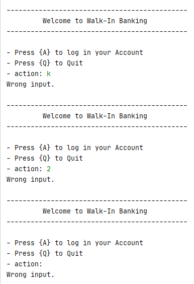

     Credentials check - incorrect - Account login
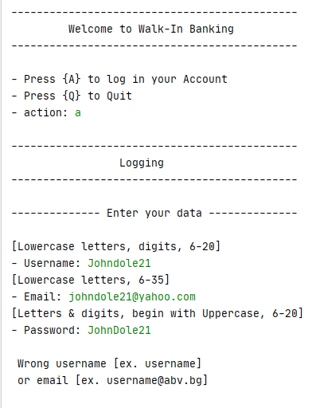

     Correct credentials and report - Account login
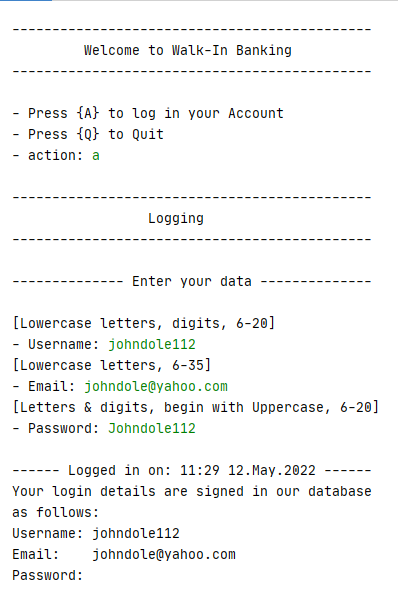

     Input check - incorrect types - enter Banking
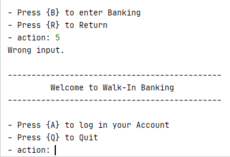

     Input check - incorrect amount of Initial Balance
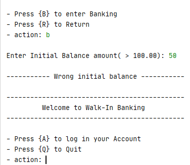

     Input check - incorrect types - Banking

     Input check - incorrect types - Banking
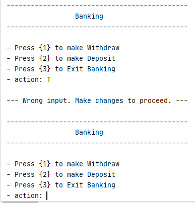

     Withdrawing money action and report
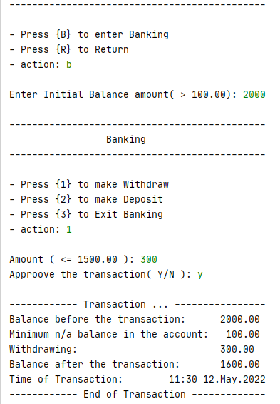

     Depositing money action and report
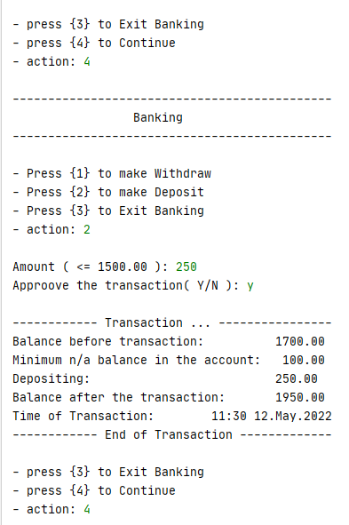

     Input check - incorrect amount - Withdrawing, Depositing
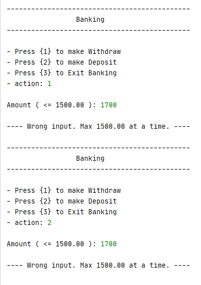

     Input check - incorrect types - Approving the transaction
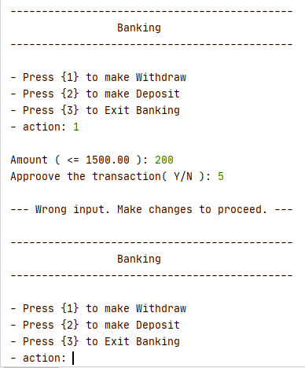

     Input check - incorrect types - Approving the transaction
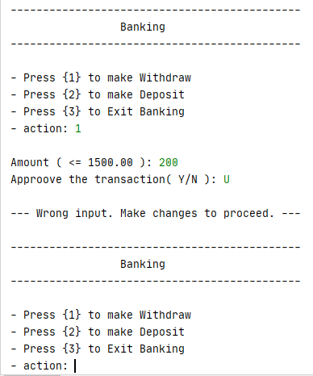

     Input check - incorrect types - Approving the transaction
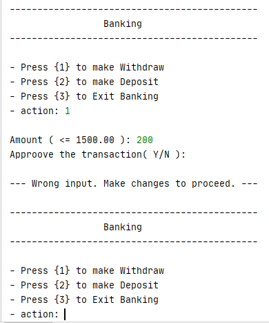

     Input check - incorrect types - Banking navigation
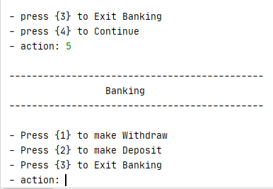

     Input check - incorrect types - Banking navigation
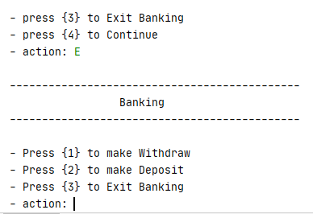

     Input check - insufficient amount - Withdrawing
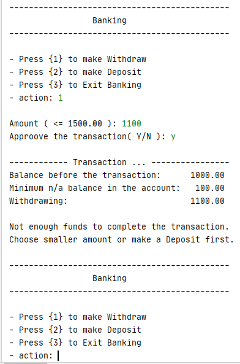

     Input check - incorrect types - Banking navigation
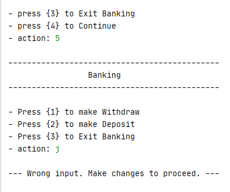

     Input check - incorrect types - Banking navigation
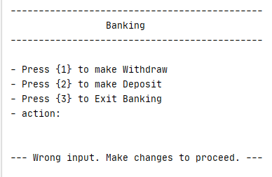

     Input check - incorrect types - Banking navigation
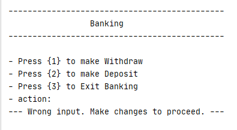

     Withdrawing money action, report and exiting Banking
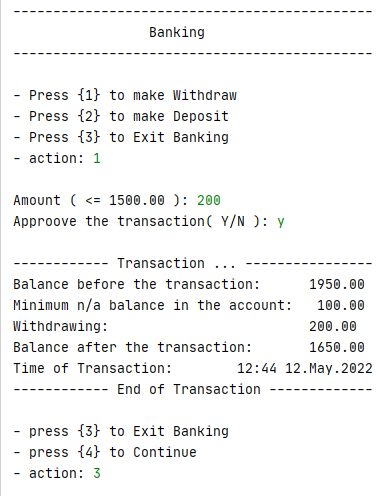

     Exiting Banking after Withdrawing, report and main Welcome menu
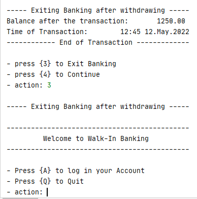

